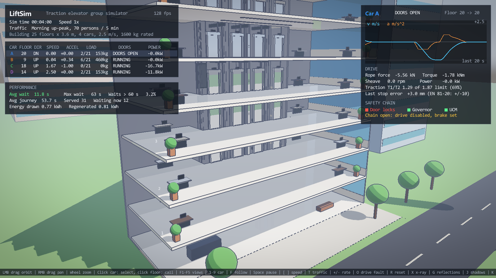
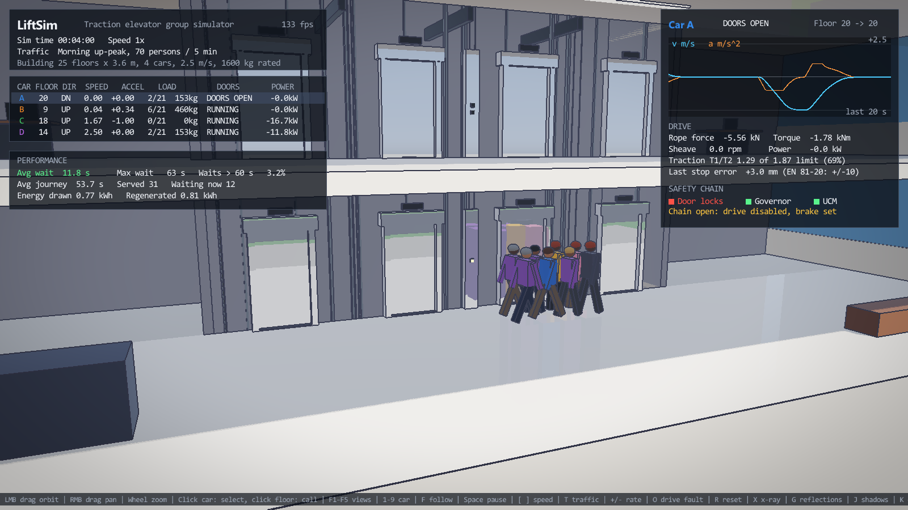
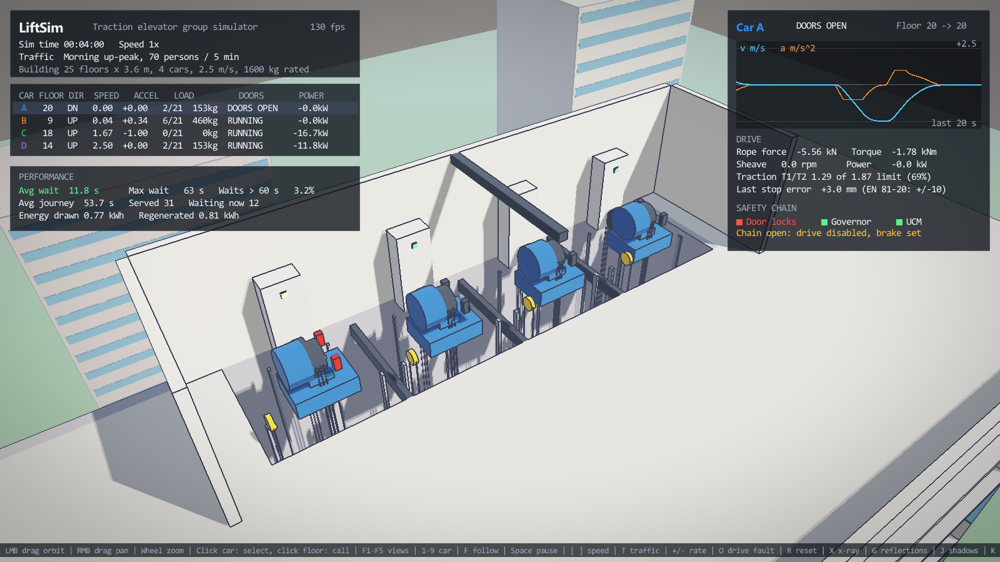
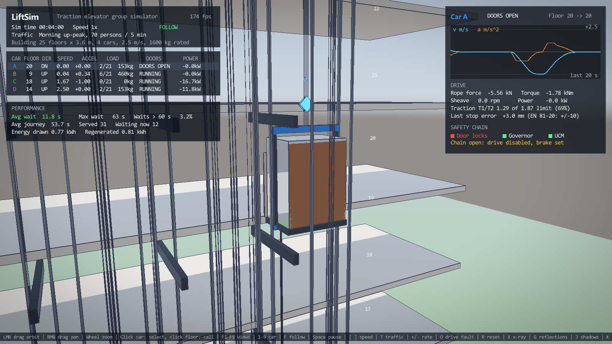

# LiftSim

**Real-time 3D simulation of a traction elevator group, written from scratch in C++17 and OpenGL 4.6.**

LiftSim models a 25-storey office tower served by four 2.5 m/s gearless traction elevators. The physics, dispatching and safety logic run in a deterministic, unit-tested simulation core. A hybrid rasterization and ray-tracing renderer visualizes it with passengers who queue, board and ride.



| Lobby: queueing at the assigned car | Machine room | Following a car (x-ray) |
|---|---|---|
|  |  |  |

## What it simulates

| Subsystem | Model |
|---|---|
| **Motion** | Jerk-limited S-curve profile generator driven by distance-to-go, a speed regulator with feed-forward and look-ahead, and a jerk limiter. Every trip stays within 2.5 m/s, 1.0 m/s² and 1.5 m/s³ and levels within ±3 mm (EN 81-20 requires ±10 mm). |
| **Traction drive** | Rope tensions on both sides of the sheave, machine torque and power, energy drawn and regenerated, and a rope-slip check with the Euler–Eytelwein (capstan) equation. |
| **Doors** | Center-opening operator with eased panel motion. The car door drives the landing door through a coupler. A light curtain reopens the doors while closing. |
| **Safety chain** | Door interlocks, an overspeed governor (trips at 115 % of rated speed and sets the safety gear), and unintended car movement (UCM) detection. The drive only runs with the chain closed. |
| **Group control** | Selective collective control (SCAN) per car. Hall calls are assigned by estimated time of arrival (ETA) and reallocated dynamically. Full cars (>80 %) bypass hall calls, and idle cars park at the lobby during up-peak. |
| **Traffic** | Poisson passenger arrivals for up-peak, down-peak, lunch and interfloor patterns. KPIs: average and maximum wait, journey time, % of waits over 60 s, energy. |
| **Fault injection** | Press `O` to lose drive control: the car freewheels toward the heavier side until the governor trips and the safety gear stops it. Press `R` to reset and run a rescue relevel. |

## Rendering

- **Three-pass pipeline:** sun shadow map, then a forward scene pass into an HDR G-buffer (color + normals), then post-processing.
- **Toon shading** with hemisphere ambient, **PCF soft shadows**, and **ink outlines** from depth and normal discontinuities.
- **Hybrid ray tracing:** metal and polished surfaces trace a reflection ray in the fragment shader against a live box scene (cars, counterweights, slabs, nearby people) using the slab test, with Schlick Fresnel weighting.
- **Ray picking:** clicking the screen casts a ray to select a car or call a car to a floor. It uses the same slab algorithm on the CPU.
- **Procedural animation:** passengers are forward-kinematics skeletons with a distance-driven walk cycle (no foot sliding). Sheaves, deflectors and governors spin at the true rope speed. The traveling cable's U-loop is solved from its fixed length.
- **Dollhouse cut-away:** walls facing the camera are culled so the building always opens toward the viewer. X-ray mode strips the architecture down to the equipment.
- ACES tone mapping, aerial fog, gamma correction.

## Build

Requirements: Windows, MSYS2 UCRT64 toolchain (g++ 13+), CMake 3.20+, Ninja, a GPU with OpenGL 4.6.

```bash
cmake -B build -G Ninja
cmake --build build
./build/liftsim_tests      # simulation unit tests
./build/liftsim_kpi        # headless traffic study (KPI table in docs/DESIGN_NOTES.md)
./build/LiftSim            # run the simulator
```

The first configure downloads SDL2 and GLM with CMake FetchContent.

## Controls

| Input | Action |
|---|---|
| Left drag / right drag / wheel | Orbit / pan / zoom |
| Click a car / click a floor | Select car / call a car to that floor |
| `F1`–`F5` | Views: overview, lobby, machine room, hoistway x-ray, follow car |
| `1`–`4`, `F` | Select car, toggle follow camera |
| `Space`, `[` `]` | Pause, simulation speed (0.25×–32×) |
| `T`, `+` `-` | Traffic pattern, arrival rate |
| `O`, `R` | Inject drive fault, reset car |
| `X`, `G`, `J`, `K`, `H` | X-ray, ray-traced reflections, shadows, outlines, HUD |

## Code map

```
src/sim/      Simulation core. Plain C++, no graphics, fully unit-tested.
  ElevatorSpec.h        building and elevator parameters (with sources)
  MotionController      S-curve profile generator + speed regulator + jerk limiter
  DoorOperator          door state machine with light-curtain reopen
  Car                   one elevator: motion, doors, traction physics, safety chain
  ElevatorSystem        group controller: hall calls, ETA dispatch, boarding, KPIs
  Traffic               Poisson traffic generator
src/view/     Turns simulation state into things to draw.
  BuildingLayout        world-space positions of everything (single source of truth)
  SceneBuilder          building, cars, machines, ropes -> draw items + ray-trace boxes
  PeopleView            passenger placement, walking, FK skeleton animation
src/render/   OpenGL: shaders, meshes, orbit camera, three-pass renderer
src/ui/       HUD: fleet table, motion trace, drive telemetry, safety chain, KPIs
assets/shaders/  scene (toon + shadows + ray tracing), shadow, post
tests/        unit tests for the simulation core
```

Suggested reading order: `ElevatorSpec.h` → `MotionController.cpp` → `Car.cpp` → `ElevatorSystem.cpp` → `main.cpp` → `Renderer.cpp` → `scene.frag` → `post.frag`.

## Documentation

- [Elevator engineering](docs/ELEVATOR_ENGINEERING.md): the physics, dispatching and safety models, with sources.
- [Rendering pipeline](docs/RENDERING.md): every pass and technique.
- [Design decisions and findings](docs/DESIGN_NOTES.md): why it is built this way and what the simulation shows.

## Tests

```
[ OK ] Every trip respects speed, acceleration and jerk limits and levels within +/-10 mm
[ OK ] Dispatcher flight-time estimate is within 25% of the simulated run
[ OK ] Doors reopen when the light curtain is interrupted while closing
[ OK ] Car refuses to run while the safety chain is open (doors unlocked)
[ OK ] Overspeed governor trips at 115% and the safety gear stops the car
[ OK ] Unintended car movement with doors open is detected and stopped
[ OK ] Ropes never slip: tension ratio stays under the traction limit at full load
[ OK ] Idle counterweighted car regenerates energy when running up empty
[ OK ] Every passenger is delivered to the right floor (up-peak, 120 people)
[ OK ] Mixed traffic for one simulated hour: nobody stranded, cars never over capacity
```

## Credits

The toon-shading and outline post-process, mesh, shader and text-rendering classes come from my earlier project *Elevator Rush*. Third-party code: SDL2, GLM, glad, stb_truetype and stb_image_write.

Parameter values are typical engineering figures drawn from published standards and handbooks (see the engineering doc). This is an educational simulation, not a certified design tool.
